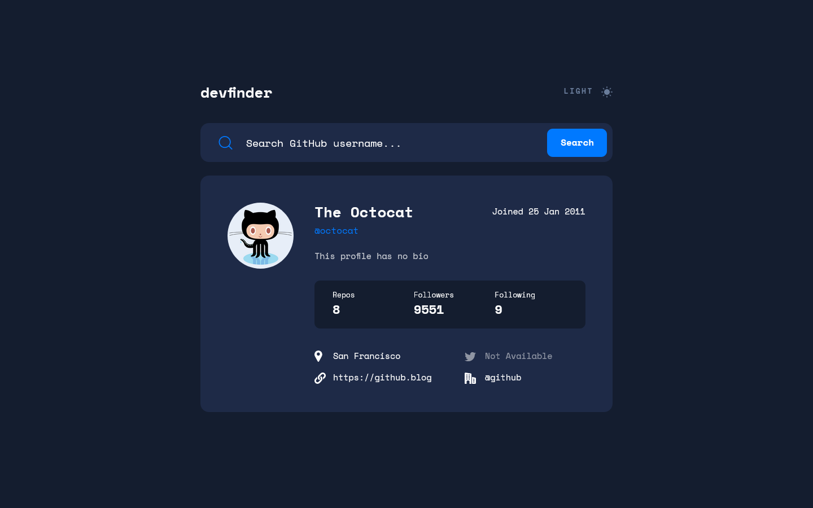

# Frontend Mentor - GitHub user search app solution

This is a solution to the [GitHub user search app challenge on Frontend Mentor](https://www.frontendmentor.io/challenges/github-user-search-app-Q09YOgaH6).

## Table of contents

- [Frontend Mentor - GitHub user search app solution](#frontend-mentor---github-user-search-app-solution)
  - [Table of contents](#table-of-contents)
  - [Overview](#overview)
    - [The challenge](#the-challenge)
  - [My process](#my-process)
    - [Built with](#built-with)
  - [Author](#author)

## Overview

### The challenge

Users should be able to:

- View the optimal layout for the app depending on their device's screen size
- See hover states for all interactive elements on the page
- Search for GitHub users by their username
- See relevant user information based on their search
- Switch between light and dark themes
- **Bonus**: Have the correct color scheme chosen for them based on their computer preferences. _Hint_: Research `prefers-color-scheme` in CSS.

### Screenshot

### Links

- Solution URL: [Mobile-first solution using Vue and TailwindCSS](https://www.frontendmentor.io/solutions/mobilefirst-solution-using-vue-and-tailwindcss-lH_W6pqWep)
- Live Site URL: [Frontend Mentor | GitHub user search app](https://github.com/Azganoth/github-user-search-app)

## My process

### Built with

- Semantic HTML5 markup
- Mobile-first workflow
- [Vue](https://vuejs.org/) - JavaScript Framework
- [TailwindCSS](https://tailwindcss.com/) - CSS Framework
- [Vite](https://vitejs.dev/) - Frontend Tooling

## Author

- Website - [Ademir José Ferreira Júnior](https://github.com/Azganoth)
- Frontend Mentor - [@Azganoth](https://www.frontendmentor.io/profile/Azganoth)
